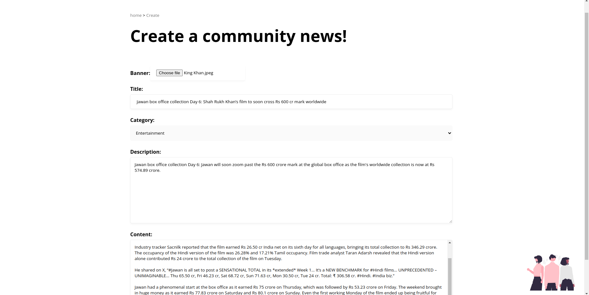
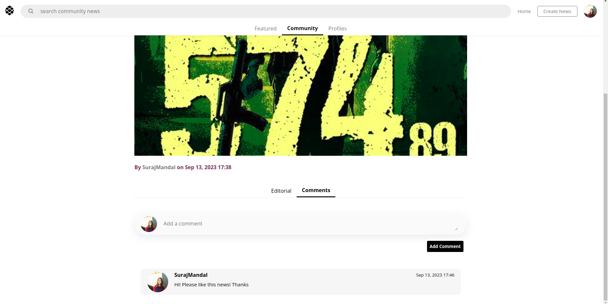

# REDDIT NEWS WEB APPLICATION

Reddit News is a web application built entirely in django that gives you the latest and the greatest news right at your fingertips.
Coupled with the feature of fetching the latest news across the globe in topics including, but not limited to Technology,
Sports, Lifestyle.
Along with that, Reddit News boasts of an engaging community to share news happening around them. After all, we love
our community and we believe that their first hand account of something crucial can be as authentic as ever possible.


## Features

- __User authentication Feature__

  - In this web application, the user is able to create accounts as well as login to their respective accounts to access multiple features of the web application. Also certain features, like details of the news are only available to logged in users.

*Login Page*


*Register Page*


- __News Fetching Feature__

  - This application uses an external api, called the [News Api](https://newsapi.org/) to fetch news and populates the home page of the web application with __headlines__, __sports__, __technology__ and __business__ news.

  - Further, upon clicking on each of news, there is an additional page that contains the content of the news, for this, *web-scraping* with beautiful soup has been done, in order to scrape the data from the original source of the news.

*Home Page*


*Featured News Detail Page*


- __Community News Feature__

  - The application also allows users to create news for the community and post them in the community tab, based on the topic of their news, they can choose the category of the news. In the community tab, there is an option to filter the news based on category as well.

*Create Community News Page*


*Community News Home Page*


*Community News Filter Page*


- __Community News Details and Commenting Feature__

  - Users can comment on a specific community news if they really liked the news and give credit to the author of the page.
  - They can also read the details of the community news, a feature which is available in the featured news as well.

*Community Details Page*


*Community Details and Comments Section*


*Comments Section*


- __Search News Feature__

  - Users can search for the news based on the search criteria entered. This feature is available both when searching for the featured news as well as when searching for the community news.

*Community News Search Feature*


*Featured News Search Feature*


- __Users Details Page__

  - Users can see the list of the users and the news posted by them in the profiles of the user as well as see the list of people currently active in the community.

  - Also the current user can delete or edit the news posted by them in the profile section. This feature is extremely useful in case the user accidentally posted a news or is unsure about the authenticity of the source of the news.

*Users List Section*


*Users Details Section*


*Users Update and Delete News Section*


## Deployment

- The site was deployed on Heroku. For that following steps were followed
  - The database of the app was changed from __MySql__ to __PostGres__, and necessary migrations were applied.
  - The following add-on was added to heroku __heroku-postgresql:mini__
  - The application was configured to use __whitenoise__ for static files serving and caching.
  - A __Procfile__ was created with the following information.

    ```plain
    web: gunicorn reddit_news.wsgi --log-file -
    ```

  - A __runtime.txt__ file was created with the following information

    ```plain
    python-3.11.5
    ```

  - Finally once the configuration is setup, changes were committed and the code was pushed to heroku using the command

    ```plain
    heroku push origin main
    ```

The live link can be found here - <https://reddit-news-app-e87573e38a1b.herokuapp.com/>

## Credits

Django docs were used primarily for implementing the features of the application.

[Django Website](https://www.djangoproject.com/)
